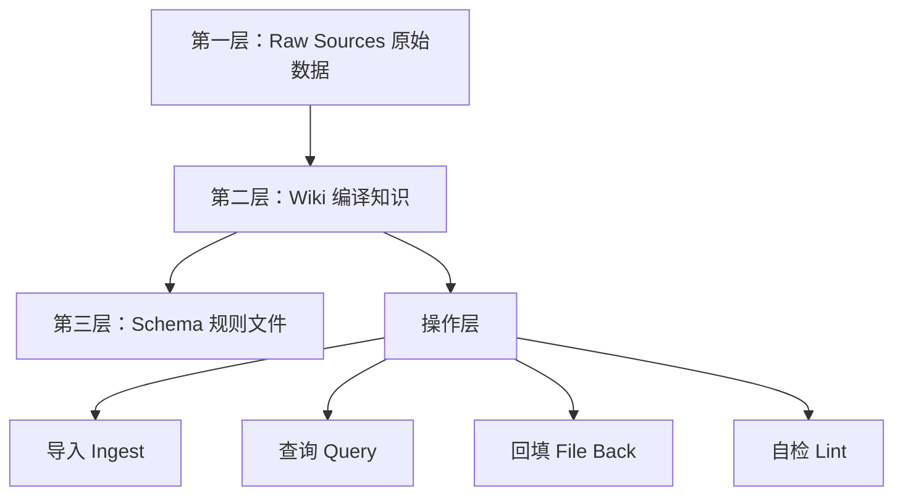

# 卡帕西「LLM Wiki」第二大脑系统深度分析

> 原文链接：https://www.163.com/dy/article/KPOTBTIH0511ABV6.html
> 
> 来源：新智元
> 
> 发布日期：2026年4月5日
> 
> 分析日期：2026年4月7日

---

## 目录

1. [引言：硅谷再次被引爆](#引言硅谷再次被引爆)
2. [核心理念：从RAG到Wiki编译](#核心理念从rag到wiki编译)
3. [LLM Wiki完整架构解析](#llm-wiki完整架构解析)
4. [四大核心操作](#四大核心操作)
5. [标杆实践：Farzapedia案例](#标杆实践farzapedia案例)
6. [数据主权与四大优势](#数据主权与四大优势)
7. [历史渊源：Memex的现代复兴](#历史渊源memex的现代复兴)
8. [与传统方案对比分析](#与传统方案对比分析)
9. [技术实现要点](#技术实现要点)
10. [应用场景与局限](#应用场景与局限)
11. [结论：知识编译时代来临](#结论知识编译时代来临)

---

## 引言：硅谷再次被引爆

### 事件影响力

2026年4月，AI圈被一个人再次引爆——**Andrej Karpathy**（卡帕西）。

这位曾任Tesla AI总监、OpenAI创始成员的传奇人物，在X平台上随手发布的一条帖子：

- 📊 **1250万次浏览**
- ⭐ **GitHub Gist获2100+ Stars**（不到12小时）
- 🔥 全球开发者社区集体炸锅

### 他做了什么？

公开了自己的**个人知识管理方式**：

> "让大模型把你的一切资料**编译**成一部活的百科全书。"

---

## 核心理念：从RAG到Wiki编译

### 传统知识管理的困境

#### 人工整理的痛点

- ✖️ 信息散落各处（笔记、收藏、截图、PDF）
- ✖️ 需要时找不到
- ✖️ 收藏越多，遗忘越快
- ✖️ 需要持续手动维护（人类天生懒得整理）

#### RAG方案的局限

当前主流的**RAG（检索增强生成）**方案：

```
原理：文档切片 → 向量数据库 → 检索片段 → 拼凑答案
```

**核心问题**（卡帕西一针见血的批评）：

> "它每次都在从零开始**重新发现**知识。没有积累。"

| RAG方案问题 | 具体表现 |
|-----------|---------|
| 🔄 重复劳动 | 每次查询都要重新检索和拼凑 |
| ❌ 无积累 | 不建立知识之间的长期联系 |
| 📉 效率低 | 同样的问题换个角度问，又要重来一遍 |
| 🧩 碎片化 | 知识以片段形式存在，缺乏整体视角 |

---

### 卡帕西的解决方案：Wiki编译范式

#### 核心理念转变

```
从：AI搜索信息
到：AI编译知识
```

| 维度 | RAG模式 | Wiki编译模式 |
|------|---------|-------------|
| **数据处理** | 切片+索引 | 理解+重构 |
| **知识表现** | 向量片段 | 结构化文章 |
| **关系建立** | 隐式相似度 | 显式链接网络 |
| **积累性** | 无积累 | 持续沉淀 |
| **AI角色** | 搜索引擎 | 知识编译器 |

#### 比喻理解

> **Obsidian = IDE**
> 
> **大模型 = 程序员**
> 
> **Wiki = 代码库**

---

## LLM Wiki完整架构解析

### 三层架构设计



---

### 第一层：原始数据（Raw Sources）

#### 定位

- 📁 所有原始素材的**不可变存储**
- 🔒 只读，AI不修改
- 🎯 真相之源

#### 内容类型

```
raw/
├── papers/          (论文PDF)
├── articles/        (网页Markdown)
├── code/            (代码文件)
├── images/          (图片)
├── datasets/        (数据集)
└── notes/           (原始笔记)
```

#### 工具推荐

**Obsidian Web Clipper插件**：
- 一键网页转Markdown
- 自动下载图片到本地
- 防止网站失效后图片丢失

---

### 第二层：Wiki（核心层）

#### 定位

整个系统的**心脏**，由AI主动维护的结构化知识体系。

#### AI自动完成的工作

| 工作类型 | 具体任务 |
|---------|---------|
| 📝 **摘要生成** | 为每篇素材写简明摘要 |
| 🔗 **反向链接** | 建立页面间的双向链接 |
| 🏷️ **概念抽取** | 识别并分类关键概念 |
| 📄 **主题文章** | 为重要主题撰写独立页面 |
| 📚 **索引维护** | 更新总索引文件（index.md） |
| 📋 **日志记录** | 记录操作历史（log.md） |

#### Wiki文件结构示例

```
wiki/
├── index.md                    # 总索引（导航地图）
├── log.md                      # 操作日志
├── concepts/                   # 概念页面
│   ├── transformer.md
│   ├── attention_mechanism.md
│   └── rag.md
├── people/                     # 人物页面
│   ├── karpathy.md
│   └── hinton.md
├── projects/                   # 项目页面
│   └── llm_wiki.md
├── comparisons/                # 对比分析
│   └── rag_vs_wiki.md
└── summaries/                  # 素材摘要
    ├── paper_001.md
    └── article_002.md
```

#### 关键特征

> "你几乎不用手动编辑Wiki里的任何内容。"
> 
> "写文章的是大模型，打标签的是大模型，建链接的是大模型。"

---

### 第三层：规则文件（Schema）

#### 定位

AI的**操作手册**和**知识库宪法**。

#### 典型文件

- `CLAUDE.md`（Claude Code中）
- `AGENTS.md`（OpenAI Codex中）

#### 内容框架

```markdown
# Wiki管理规则

## 文件组织原则
- 概念页面命名规范
- 目录结构标准
- 链接建立规则

## 操作流程
- 新素材导入流程
- 冲突信息处理策略
- 页面更新触发条件

## 质量标准
- 摘要长度要求
- 链接密度建议
- 索引更新频率

## 进化机制
- 规则优化建议
- 用户反馈整合
```

#### 共同进化

> "这份文件由你和大模型**共同进化**。"

---

## 四大核心操作

### 1. 导入（Ingest）

#### 操作流程

```
1. 用户：将新素材放入 raw/ 文件夹
2. 用户：告诉AI "处理这个"
3. AI：读取+分析素材
4. AI：与用户讨论关键发现
5. AI：编写摘要页面
6. AI：更新总索引
7. AI：识别相关页面（10-15个）
8. AI：批量更新关联页面
```

#### 卡帕西的偏好

> "我喜欢一次导入一篇，边导入边看AI写的摘要，确保方向对了。"

#### 批量处理

当然也支持：一次扔100篇论文，让AI自己消化。

---

### 2. 查询（Query）

#### 卡帕西的实践发现

**实验数据**：
- 📖 100篇文章
- 📊 40万字规模
- ❌ **不需要复杂RAG**
- ✅ 只需维护好索引和摘要

#### 查询工作流

```
1. AI读取总索引（index.md）
2. 定位相关主题页面
3. 钻入具体页面查看细节
4. 综合信息生成答案
```

#### 输出格式灵活

- 📄 Markdown文章
- 🎬 Marp幻灯片
- 📊 matplotlib图表
- 🎨 任何可视化形式

---

### 3. 回填（File Back）

#### 核心理念

> "把查询结果存回Wiki——你的每一次提问，都在让知识库变得更丰富。"

#### 价值循环

```
查询问题 → AI生成深度分析 → 归档为新页面 → 成为知识库一部分 → 提升后续查询质量
```

#### 范式转变

| 传统模式 | Wiki模式 |
|---------|---------|
| 提问是消耗 | 提问是投资 |
| 用完即弃 | 持续积累 |
| 线性增长 | 复利增长 |

> "用的越多，它越聪明。"

---

### 4. 自检（Lint）

#### 定期体检机制

**检查项目**：

1. 🔍 **数据一致性**
   - 发现矛盾信息
   - 识别过时结论

2. 🆕 **新旧冲突**
   - 新素材推翻旧观点
   - 触发更新提醒

3. 🔗 **链接完整性**
   - 找出重要但缺页的概念
   - 发现孤立页面

4. 🌐 **信息补全**
   - 通过网络搜索填补空缺
   - 主动建议新增条目

#### VentureBeat评价

> "这就像一个能**自我修复**的活知识库。"

---

## 标杆实践：Farzapedia案例

### 开发者Farza的实验

#### 原始数据

- 📝 2500条日记
- 📱 Apple Notes笔记
- 💬 部分iMessage对话

#### 输出成果

**Farzapedia**：一部关于Farza自己的个人维基百科

- 📚 **400篇结构化文章**
- 🧑 朋友圈人物档案
- 🏢 创办公司历史
- 🔬 研究领域总结
- 🎬 最爱动漫及其影响

---

### 核心洞见：为Agent而设计

> "Farzapedia不是给Farza自己看的，是给他的**AI Agent**用的。"

#### Agent友好特性

```
1. 从 index.md（总目录）开始
2. 像蜘蛛一样顺着链接爬取
3. 一层层钻到所需的具体页面
4. 文件系统结构，Agent天然理解
```

---

### 实战案例：设计落地页

#### 需求

> "我最近有什么影响了我审美的电影和图片？帮我找找灵感。"

#### Agent工作流

1. 📖 在Wiki中找到"哲学"文章
   - 发现吉卜力纪录片笔记
   
2. 🔍 查看"竞品分析"文章
   - 找到YC公司落地页截图
   
3. 🎨 翻出"灵感收藏"
   - 1970年代披头士周边设计

#### 结果

> "极其精准、极其懂他的创意方案。"

---

### 与RAG方案对比

#### Farza的亲身体验

| 方案 | 时间 | 体验 |
|------|------|------|
| RAG系统 | 一年前 | 体验很差 |
| Wiki系统 | 现在 | 天差地别 |

#### 核心差异

> "文件系统的知识库，让Agent通过它真正理解的**目录结构**去查找信息。"

---

### 自生长特性

#### 自动归档机制

新内容添加时，系统自动：

1. 判断应归入哪2-3篇已有文章
2. 或创建新文章
3. 更新相关链接
4. 维护索引一致性

#### Farza的比喻

> "它就像一个**超级天才图书管理员**，专门管理你的大脑——它永远在帮你把东西归到最合适的位置，而且它从不疲倦。"

---

## 数据主权与四大优势

### 卡帕西的核心价值主张

> "这种个性化方案把你放在了**完全的控制位**上。"

---

### 优势一：显式（Explicit）

#### 传统AI记忆的问题

❌ **黑箱记忆**：
- 看不见AI记住了什么
- 摸不着具体存了什么
- 不知道记忆的准确性

✅ **Wiki显式记忆**：
- 可导航的知识网络
- 清晰看到AI知道/不知道什么
- 可检视和管理的"记忆制品"

---

### 优势二：你的（Yours）

#### 数据所有权

```
传统方案：数据在云端 → 厂商控制 → 训练数据风险
Wiki方案：数据在本地 → 用户控制 → 完全私有
```

#### 关键保障

- 🔒 不担心被用于训练
- 🔄 随时可迁移
- 💾 永久保留权

---

### 优势三：文件优于应用（File over App）

#### 技术选择

**格式**：
- Markdown文件
- 图片（标准格式）

**优势**：
- ✅ 任何工具都能读取
- ✅ 任何Agent都能操作
- ✅ 未来兼容性强
- ✅ 互操作性好

#### 工具自由度

```
Obsidian 或 自定义界面 或 任何Markdown编辑器
```

---

### 优势四：自带AI（BYOAI - Bring Your Own AI）

#### AI自由选择

```
Claude
Codex
开源模型
微调专属模型
```

#### 竞争导向

| 传统方案 | Wiki方案 |
|---------|---------|
| 绑定特定AI服务 | 自由选择AI |
| 供应商锁定 | 供应商竞争 |
| 被动接受升级 | 主动选择最优 |

> "让AI厂商之间的竞争为你服务，你只管挑最好的用。"

#### 终极玩法

> "甚至可以把Wiki当训练数据，微调一个**从权重层面就认识你**的专属AI。"

---

## 历史渊源：Memex的现代复兴

### Vannevar Bush的1945年构想

#### 《As We May Think》论文

**Memex系统设想**：

- 📚 个人化知识存储系统
- 🔗 文档间的"关联线索"（associative trails）
- 🧠 模仿人类联想思维

#### 核心理念

> "文档之间的**连接**和文档本身一样有价值。"

---

### 未能实现的原因

❓ **1945年的技术瓶颈**：

```
问题：谁来做维护？
```

- 人工维护成本太高
- 交叉引用难以管理
- 知识网络难以扩展

---

### 互联网的偏离

1990年代互联网确实实现了文档连接，但方向不同：

| Memex构想 | 互联网实践 |
|-----------|-----------|
| 个人化 | 公共化 |
| 结构化 | 碎片化 |
| 策展式 | 自由式 |

---

### 2026年的技术突破

#### 大模型解决的核心问题

> "AI负责所有枯燥的维护工作。"

**具体任务**：
- 更新交叉引用
- 保持摘要最新
- 发现数据矛盾
- 维护数百页面一致性

#### 历史意义

```
1945年 Memex → 画在纸上
2026年 LLM Wiki → 跑在笔记本上
```

这是对Bush构想的**现代编译**。

---

## 与传统方案对比分析

### 三种范式对比

| 维度 | 手动知识库 | RAG系统 | LLM Wiki |
|------|-----------|---------|----------|
| **维护方式** | 人工整理 | 自动索引 | AI主动编译 |
| **知识表现** | 文件夹+笔记 | 向量片段 | 结构化Wiki |
| **关联建立** | 手动链接 | 相似度计算 | AI理解+显式链接 |
| **查询方式** | 关键词搜索 | 向量检索 | 语义导航 |
| **积累性** | 需持续投入 | 无积累 | 自动积累 |
| **成本曲线** | 线性增长 | 稳定 | 递减（边际成本降低） |
| **智能反馈** | 无 | 无 | 有（回填机制） |

---

### 为何传统知识库失败？

#### 成本-价值曲线

```
维护成本增长速度 > 知识价值增长速度
```

**结果**：人类放弃维护

#### LLM Wiki的解决

```
AI消除维护成本瓶颈 → 知识价值无限积累
```

---

### RAG vs Wiki：本质区别

#### 类比理解

| RAG | Wiki |
|-----|------|
| 搜索引擎 | 编译器 |
| 每次重新检索 | 预先编译结构 |
| 被动响应 | 主动维护 |
| 临时拼凑 | 长期沉淀 |

#### 应用场景差异

**RAG适用**：
- 一次性问答
- 通用文档查询
- 无需积累的场景

**Wiki适用**：
- 长期知识积累
- 个人/团队知识库
- 需要知识网络的场景

---

## 技术实现要点

### 最小可行架构

#### 核心组件

```
1. 文件系统（raw/ + wiki/）
2. Markdown编辑器（Obsidian推荐）
3. 大模型API（Claude/GPT-4等）
4. 自动化脚本（Python/Node.js）
```

---

### 关键技术决策

#### 1. 文件格式选择

**为什么是Markdown？**

- ✅ 人类可读
- ✅ AI友好
- ✅ 版本控制兼容（Git）
- ✅ 跨平台支持
- ✅ 未来证明（Future-proof）

#### 2. 存储策略

**本地优先**（Local-first）：

```
优点：
- 数据主权
- 离线访问
- 隐私保护
- 无供应商锁定
```

#### 3. AI选择

**多模型策略**：

| 任务类型 | 推荐模型 |
|---------|---------|
| 理解+编译 | Claude Sonnet 4 |
| 快速摘要 | GPT-4o-mini |
| 代码相关 | Codex |
| 本地部署 | LLaMA 3 |

---

### 工作流自动化

#### 导入流程脚本示例

```python
# 伪代码示意
def ingest_document(file_path):
    # 1. 读取原始文档
    content = read_file(file_path)
    
    # 2. AI分析
    analysis = llm.analyze(content)
    
    # 3. 生成摘要页
    summary_page = create_summary(analysis)
    
    # 4. 抽取概念
    concepts = extract_concepts(analysis)
    
    # 5. 更新相关页面
    related_pages = find_related_pages(concepts)
    for page in related_pages:
        update_page(page, new_info)
    
    # 6. 更新索引
    update_index(summary_page, concepts)
    
    # 7. 记录日志
    log_operation("ingest", file_path)
```

---

### Obsidian配置建议

#### 核心插件

1. **Web Clipper** - 网页转Markdown
2. **Dataview** - 动态查询
3. **Graph View** - 可视化知识网络
4. **Templater** - 模板自动化

#### 文件夹结构

```
KnowledgeBase/
├── raw/                    # 原始素材
│   ├── papers/
│   ├── articles/
│   └── notes/
├── wiki/                   # 编译知识库
│   ├── index.md
│   ├── log.md
│   ├── concepts/
│   ├── people/
│   └── projects/
├── schema/                 # 规则文件
│   └── CLAUDE.md
└── scripts/                # 自动化脚本
    ├── ingest.py
    ├── query.py
    └── lint.py
```

---

## 应用场景与局限

### 理想应用场景

#### ✅ 高度适用

1. **研究人员**
   - 论文管理
   - 文献综述
   - 研究脉络追踪

2. **知识工作者**
   - 项目知识积累
   - 跨项目经验复用
   - 个人成长记录

3. **内容创作者**
   - 灵感库管理
   - 主题研究
   - 写作素材组织

4. **创业者/产品经理**
   - 竞品分析
   - 用户反馈整理
   - 决策依据归档

5. **终身学习者**
   - 课程笔记
   - 读书摘要
   - 技能树构建

---

### 潜在局限

#### ⚠️ 需要注意

| 局限类型 | 具体说明 | 缓解方案 |
|---------|---------|---------|
| 🕐 **初期投入** | 导入历史数据耗时 | 分批导入，先从核心资料开始 |
| 💰 **API成本** | 大量Token消耗 | 使用本地模型，或按需调用 |
| 🎯 **质量控制** | AI生成内容可能有误 | 定期人工审核，重要内容验证 |
| 🔒 **隐私风险** | 上传到商业API | 使用本地模型，或数据脱敏 |
| 📚 **规模限制** | 超大规模可能需要分库 | 按领域分离Wiki |
| 🧠 **学习曲线** | 需要理解系统逻辑 | 从小规模开始实践 |

---

### 不适用场景

#### ❌ 可能不适合

1. **简单任务**
   - 临时信息查询
   - 一次性项目

2. **极度隐私敏感**
   - 医疗记录
   - 法律文件
   - 除非使用完全本地化方案

3. **实时协作**
   - 团队实时编辑
   - 需要权限管理
   - 除非配合Git工作流

4. **结构化数据**
   - 数据库类应用
   - 表格为主的内容
   - 除非混合方案

---

## 结论：知识编译时代来临

### 范式转变总结

#### 三个时代的演进

```
1.0 手工时代：人工整理知识
    └─ 瓶颈：维护成本过高

2.0 检索时代：AI帮你搜索（RAG）
    └─ 瓶颈：无积累，每次重新检索

3.0 编译时代：AI帮你编译知识（Wiki）
    └─ 突破：持续积累，自我进化
```

---

### 核心价值重述

#### 对个人

- 🧠 **第二大脑**：永不遗忘，持续成长
- 💡 **知识复利**：用得越多，越聪明
- 🎯 **精准助手**：深度理解你的Agent

#### 对AI生态

- 🔓 **数据主权**：用户掌控自己的知识
- 🔄 **供应商竞争**：自由选择最优AI
- 🌐 **互操作性**：开放标准，长期可用

#### 对技术发展

- 📚 **知识表示**：从向量到结构
- 🤖 **AI角色**：从工具到伙伴
- 🌱 **系统进化**：从静态到动态

---

### 卡帕西的深层洞察

> "大模型的下一个战场，不是写更多代码，而是**管理更多知识**。"

#### Token使用转移

```
过去：大部分Token跑代码
现在：大部分Token跑知识库
```

这代表着AI应用重心的根本转移：

```
从执行工具 → 到知识管理助手
从"做什么" → 到"记住什么、怎么组织"
```

---

### 未来展望

#### 短期（1-2年）

1. **工具生态成熟**
   - 更多LLM Wiki工具
   - Obsidian深度集成
   - 可视化管理界面

2. **最佳实践涌现**
   - 行业特定模板
   - 优化的Schema
   - 自动化程度提升

3. **社区知识分享**
   - Wiki模板市场
   - 概念本体共享
   - 最佳实践库

#### 中期（3-5年）

1. **Agent深度集成**
   - Personal AI全面接入Wiki
   - 多Agent协作
   - 跨平台同步

2. **协作Wiki**
   - 团队知识库
   - 权限管理
   - 版本控制集成

3. **多模态知识**
   - 视频内容编译
   - 音频笔记整合
   - 3D/VR知识空间

#### 长期（5年+）

1. **知识互联网**
   - 个人Wiki互联
   - 知识图谱标准化
   - 去中心化知识网络

2. **AI认知增强**
   - Wiki作为长期记忆
   - 持续学习机制
   - 个性化AI微调

3. **人机共生**
   - 知识无缝流转
   - 思维外部化
   - 集体智慧涌现

---

### 给实践者的建议

#### 立即可行的步骤

##### 第一周：搭建框架

```
1. 安装Obsidian
2. 创建raw/和wiki/文件夹
3. 选择一个AI（推荐Claude）
4. 导入10篇核心资料试水
```

##### 第一月：建立习惯

```
1. 每天导入1-2篇新内容
2. 每周做一次查询练习
3. 回填有价值的查询结果
4. 观察Wiki如何生长
```

##### 第一季度：形成系统

```
1. 制定个人Schema
2. 设置定期Lint机制
3. 优化工作流自动化
4. 评估收益和改进点
```

---

### 最终启示

#### 卡帕西的金句

> "人类负责思考，AI负责记住。这可能是大模型最**朴素**、却也最**深刻**的一个应用方向。"

#### 新智元的评论

> "不炫技，不烧钱，不需要百万Token的上下文窗口，不需要复杂的向量数据库——就是一堆Markdown文件，加上一个勤劳的AI图书管理员。"

#### 历史对话

```
1945年 Vannevar Bush：Memex只能画在纸上
2026年 Andrej Karpathy：LLM Wiki跑在你的笔记本上
```

---

## 核心要点速记卡

```
🎯 核心理念：从"AI搜索信息"到"AI编译知识"

🏗️ 三层架构：Raw（原始）→ Wiki（编译）→ Schema（规则）

🔄 四大操作：导入 → 查询 → 回填 → 自检

💎 四大优势：显式 + 你的 + 文件优于应用 + 自带AI

🌱 本质特征：自我生长、持续积累、越用越聪明

🎓 历史意义：Memex构想的现代复兴

🚀 未来方向：Agent的长期记忆基础设施
```

---

## 参考资料

### 核心来源

- **卡帕西X帖子**：https://x.com/karpathy/status/2040470801506541998
- **GitHub Gist**：https://gist.github.com/karpathy/442a6bf555914893e9891c11519de94f
- **Farza的Farzapedia**：实践案例

### 相关阅读

1. Vannevar Bush (1945): "As We May Think"
2. VentureBeat报道：LLM Wiki分析
3. 新智元原文分析

### 工具资源

- **Obsidian**: https://obsidian.md/
- **Web Clipper插件**
- **Claude API**
- **OpenAI API**

---

**文档创建时间**：2026年4月7日

**版本**：v1.0

**作者**：基于新智元文章的深度分析

---

## 附录：与第一篇分析的对比

本文档与《卡帕西个人知识库深度分析.md》的互补关系：

| 维度 | 第一篇（36Kr） | 本篇（网易） |
|------|--------------|-------------|
| **视角** | 宏观影响与意义 | 技术实现与实践 |
| **重点** | 范式转变分析 | 架构与操作细节 |
| **案例** | 概念性描述 | Farzapedia详细解析 |
| **受众** | 思想者、决策者 | 实践者、开发者 |
| **价值** | 理解"为什么" | 掌握"怎么做" |

**建议阅读顺序**：
1. 先读第一篇 → 理解意义
2. 再读本篇 → 掌握实践
3. 动手搭建 → 亲身体验
