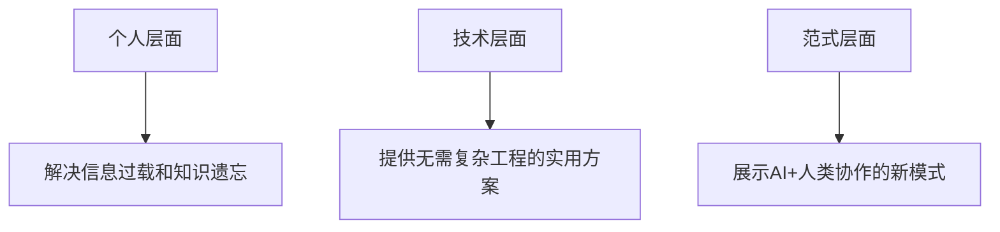

# 卡帕西AI驱动个人知识库深度分析

> 原文链接：https://www.36kr.com/p/3751033456263943
> 
> 分析日期：2026年4月7日

---

## 目录

1. [核心创新点](#核心创新点)
2. [三步搭建方法论](#三步搭建方法论)
3. [深层影响分析](#深层影响分析)
4. [方法论的本质价值](#方法论的本质价值)
5. [潜在局限与思考](#潜在局限与思考)
6. [结论](#结论)

---

## 核心创新点

### 1. 从"存储工具"到"运行系统"的范式转变

#### 传统知识库的本质问题：
- 需要人工持续维护和整理
- 信息孤立，缺乏关联
- "看完就忘、一找就废"的困境
- 知识库会随着懒惰而逐渐废弃

#### 卡帕西的方案

将知识库从被动的数据存储转变为由AI驱动的**自主进化系统**，核心特征是"会自己更新、越用越聪明"。

### 2. 知识的"循环增长"机制

最关键的设计理念是**闭环循环**：

```
原始资料 → AI整理成维基 → 用户查询 → 生成新知识 → 归档回维基 → 知识库更新
```

这种设计使得：
- ✅ 每次提问都不是消耗，而是对知识库的**增量贡献**
- ✅ 系统不是衰退的，而是**持续成长**的
- ✅ 知识库成为真正的"第二大脑"

---

## 三步搭建方法论

### 第一步：导入数据（Raw → Wiki编译）

#### 操作流程

1. 将所有资料（论文、文章、代码等）打包进 `raw/` 文件夹
2. 无需人工整理，直接让大模型"编译"成结构化维基

#### AI自动完成的工作

| 功能 | 说明 |
|------|------|
| **摘要生成** | 为每篇内容写简短总结 |
| **反向链接** | 自动建立内容间的关联 |
| **概念分类** | 智能归类（如"Transformer → 深度学习/注意力机制"） |
| **新文章创作** | 基于已有资料生成综述性内容 |

#### 工具推荐

- **Obsidian Web Clipper插件**：一键将网页转为Markdown + 本地图片保存

#### 核心优势

形成**互相引用的知识网络**，而非线性的文件列表。

---

### 第二步：前端查看（Obsidian浏览）

使用Obsidian作为可视化界面，可以：

- 📁 浏览原始数据（raw/）
- 📚 查看编译好的维基
- 📊 生成可视化图表
- 🎬 使用插件（如Marp生成PPT）

#### 重要观念

> 卡帕西强调自己**几乎从不直接修改维基内容**，所有维护工作交给AI完成。

---

### 第三步：使用与循环进化

#### （1）按需读取，无需复杂RAG

**实践发现**：
- 📖 100篇文章、40万字规模的知识库
- 🚫 **不需要复杂的RAG（检索增强生成）**
- ✅ 只需AI维护好索引和摘要，就能轻松读取相关信息

#### （2）输出归档机制

**关键操作**：将AI的输出结果归档回维基

- 每次探索和提问都在知识库中沉淀
- 形成持续累积效应

#### （3）两层自主维护能力

##### A. "Lint+Heal"机制

AI定期扫描整个知识库，自动完成：

```
🔍 发现数据不一致
📝 补全缺失信息
💡 主动建议新增条目
🌐 通过外部搜索补齐空缺
```

##### B. CLI工具层

- 提供搜索和访问接口
- 让AI高效检索内容
- 支持命令行/网页访问

---

## 深层影响分析

### 1. 颠覆"上下文窗口竞赛"的逻辑

#### 传统困境

- AI容易忘记之前的内容
- 需要不断扩大上下文窗口
- 本质是"记忆问题"

#### 新范式转变

| 从 | 到 |
|----|-----|
| 让模型记住 | 让系统可查找 |
| 临时信息 | 长期存储 |
| 纯消耗 | 持续补充 |

#### 核心洞见

- 模型不需要记住一切
- 只需知道**"什么东西在哪里"**
- 通过良好的索引和文件组织替代无限上下文

---

### 2. 对智能体时代的革命性意义

> "拥有自己知识层的Agent，并不需要无限的上下文窗口——它们只需要良好的文件组织能力，以及读取自己索引的能力。"
> 
> —— 网友评论

#### 对比分析

| 维度 | 传统方式 | 卡帕西方式 |
|------|---------|-----------|
| **信息获取** | 每轮从共享内存临时提取 | 构建持续存在的知识库 |
| **提示词策略** | 把所有东西塞进巨大提示词 | 按需读取，精准检索 |
| **成本与扩展** | 成本高、扩展性差 | 更便宜、扩展性强 |
| **可维护性** | 难以检查和理解 | 易于检查和理解 |

#### 智能体的演进方向

```
从"任务协调者" → 到"知识维护者"
```

- 每次执行都为组织化知识贡献增量
- 形成**机构化记忆**（Institutional Memory）

---

### 3. Token使用方式的转变

卡帕西自己的感慨：

> "大部分Token已经不跑代码了"

#### 解读

- AI能力的应用重心转移
- 从执行工具 → 到知识管理助手
- 重点从"做什么" → 到"记住什么、怎么组织"

---

## 方法论的本质价值

### 最简单但最有效的AI架构

网友评价：

> "真正的洞见在于这个循环……每个查询都让维基变得更好。它不断积累，现在这就像一个自我构建的第二大脑。"

### 三个层次的价值



1. **个人层面**：解决信息过载和知识遗忘问题
2. **技术层面**：提供无需复杂工程的实用方案
3. **范式层面**：展示AI+人类协作的新模式

---

### 可复制性强

整个方案的优势：

- ✅ 不需要复杂的技术栈
- ✅ 基于现有工具（Obsidian + LLM）
- ✅ 关键在于**工作流设计**而非技术实现
- ✅ 普通人也能快速上手

---

## 潜在局限与思考

### 可能的挑战

| 挑战 | 说明 |
|------|------|
| 🕐 **早期投入成本** | 初始的手动导入仍需时间 |
| 🎯 **质量控制** | AI生成内容的准确性需要验证 |
| 🔒 **隐私考虑** | 个人资料上传到LLM的安全性 |
| 💰 **成本问题** | 大量Token消耗的费用 |

---

### 适用场景

#### ✅ 最适合

- 研究人员、知识工作者
- 需要长期积累领域知识的人
- 多项目并行，需要跨项目知识复用

#### ⚠️ 可能不适合

- 简单任务、短期项目
- 对隐私极度敏感的场景
- 预算有限的个人用户

---

## 结论

卡帕西的个人知识库方案不仅仅是一个工具教程，更是对**AI时代知识管理范式**的深刻思考：

### 1️⃣ 从被动工具到主动系统

知识库从需要人维护的存储器，变成会自我进化的生命体

### 2️⃣ 从线性增长到指数增长

通过循环反馈机制，实现知识的复利效应

### 3️⃣ 从技术竞赛到架构智慧

证明了好的系统设计比单纯的技术参数（如上下文窗口）更重要

### 4️⃣ 从个人工具到智能体基础设施

为未来的AI Agent提供了一个可行的"长期记忆"解决方案

---

## 最终启示

> 在AI时代，真正的生产力提升不在于追逐最新模型，而在于**设计与AI协作的良好机制**——让AI不仅是工具，更是会成长的伙伴。

---

## 核心要点速记

```
📌 核心理念：知识库 = 自主进化系统
🔄 关键机制：查询结果归档 → 持续增长
🎯 技术路线：简单工具 + 工作流设计
💡 范式转变：从"让模型记住"到"让系统可查找"
🚀 未来方向：智能体的机构化记忆基础
```

---

## 参考资料

- 原文链接：https://www.36kr.com/p/3751033456263943
- 来源：量子位（微信公众号）
- 卡帕西推特：https://x.com/karpathy/status/2039805659525644595

---

**文档创建时间**：2026年4月7日
**版本**：v1.0
